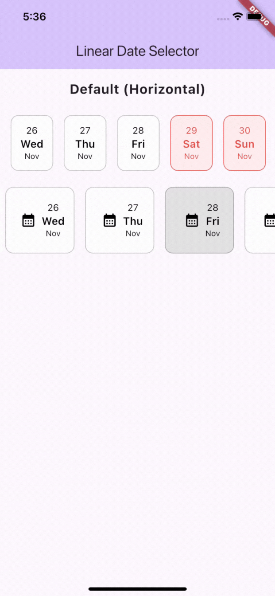
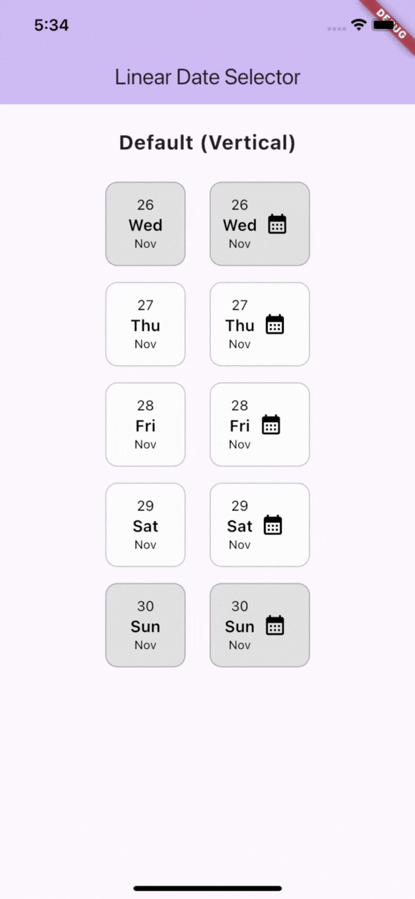
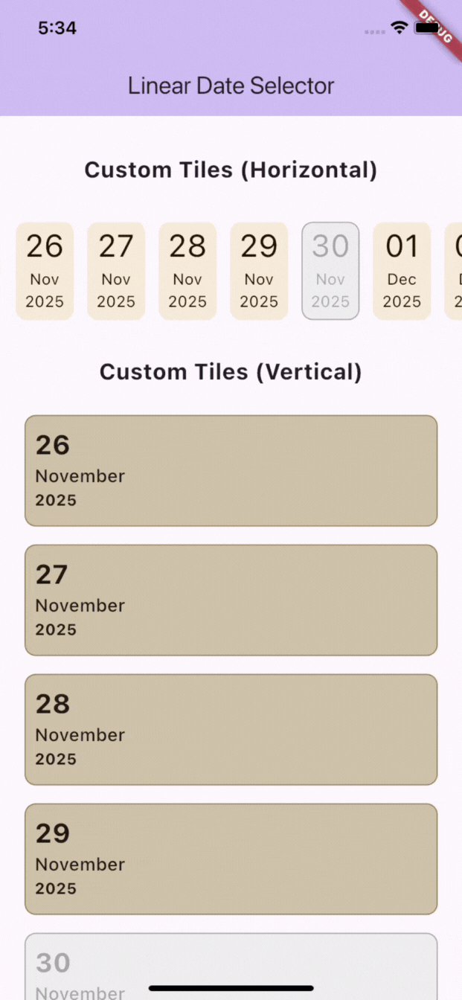

# linear_date_selector 🔗

A lightweight, customizable horizontal/vertical date selector widget for Flutter.

`linear_date_selector` provides a simple, robust UI for displaying a linear sequence of dates (e.g., today + next N days) with built-in selection, disabled-date support, animations, and a fully custom tile builder—similar to `ListView.builder`.

[Link](https://linear-date-selector-web.vercel.app/)

---

## Screenshots





## ✨ Features

- Auto-generated date list starting from a provided `todaysDateTime`
- Horizontal or vertical scrolling
- Default, polished tile UI out of the box
- Fully customizable tiles with `LinearDateSelector.builder(...)`
- Disable specific dates (non-selectable)
- Optional icon with flexible alignment: `top`, `bottom`, `left`, `right`
- **Tap scale (click) animation**
- **Optional background and text color animations**
- Customizable animation durations
- Simple API and small footprint — no heavy calendar widgets

---

## 🚀 Getting started

Add to your `pubspec.yaml` after publishing:

```yaml
dependencies:
  linear_date_selector: ^0.0.1
```

Then run:

```bash
flutter pub get
```

---

## Usage

Important: this package's constructors use startDateTime (item index 0 == startDateTime).

### Default tiles (quick start)

```dart
import 'package:flutter/material.dart';
import 'package:linear_date_selector/linear_date_selector.dart';

// inside a widget build
LinearDateSelector(
  startDateTime: DateTime.now(),
  itemCount: 7,
  onDateTimeSelected: (selected) {
    print('selected: $selected');
  },
  // optional: an icon shown inside each tile
  icon: Icon(Icons.event),
  iconAlignment: LinearDateSelectorIconAlignment.bottom,
  // optional sizing
  itemWidth: 72,
  itemHeight: 80,
);
```

### 🧪 Custom builder (full control)

Use `.builder` to get (context, date, isSelected, isDisabled, index, style) and return any widget:

```dart
LinearDateSelector.builder(
  listPadding: const EdgeInsets.all(8),
  startDateTime: DateTime.now(),
  itemCount: 10,
  itemHeight: 120,
  axis: Axis.horizontal,
  disabledDateTimes: [
    DateTime.now().add(const Duration(days: 4)),
  ],
  onDateTimeSelected: (d) => print('selected $d'),
  itemBuilder: (
    context,
    date,
    isSelected,
    isDisabled,
    index,
    _,
  ) {
    return AnimatedContainer(
      duration: const Duration(milliseconds: 200),
      margin: const EdgeInsets.symmetric(horizontal: 6, vertical: 8),
      decoration: BoxDecoration(
        color: isDisabled
            ? Colors.grey.shade200
            : (isSelected ? const Color(0xFF1e1405) : const Color(0xFFf8e9d7)),
        borderRadius: BorderRadius.circular(10),
        border: Border.all(
          color: isDisabled
              ? Colors.grey
              : (isSelected ? const Color(0xFF1e1405) : const Color(0xFFf8e9d7)),
        ),
      ),
      child: Column(
        children: [
          Center(
            child: Text.rich(
              TextSpan(
                children: [
                  TextSpan(
                    text: '${DateFormat('dd').format(date)}\n',
                    style: const TextStyle(fontSize: 28),
                  ),
                  TextSpan(
                    text: DateFormat('MMM\nyyyy').format(date),
                    style: const TextStyle(fontSize: 14),
                  ),
                ],
              ),
              textAlign: TextAlign.center,
              style: TextStyle(
                color: isDisabled
                    ? Colors.grey
                    : (isSelected
                        ? const Color(0xFFf8e9d7)
                        : const Color(0xFF1e1405)),
                fontWeight: isSelected ? FontWeight.bold : FontWeight.normal,
              ),
            ),
          ),
        ],
      ),
    );
  },
);

```

> **Note:** The `index` parameter corresponds to the tile's position (0 is `todaysDateTime`). Use it for special styling (e.g., first/last tile) or animations.

---

## API

### `LinearDateSelector`

Constructors:

- `LinearDateSelector(...)`— default tiles and optional animations.
- `LinearDateSelector.builder(...)` — accept a custom `itemBuilder` function.

Important properties:

- `startDateTime` — `DateTime` where the list starts (index 0).
- `onDateTimeSelected` — `Function(DateTime)` callback when a date is chosen.
- `disabledDateTimes` — `List<DateTime>` of dates that should be rendered disabled.
- `itemCount` — number of tiles to show (must be > 0).
- `axis` — `Axis.horizontal` (default) or `Axis.vertical`.
- `itemWidth`, `itemHeight` — optional size of each tile.
- `icon`, `iconAlignment` — optional icon and position.
- `listPadding` — padding around the scrollable list.
- `enableClickAnimation` — whether tap-scale animation is enabled (default `true`).
- `scaleAnimationDuration` — duration for the tap-scale animation.
- `enableColorAnimation` — enables background/text color animation for default tiles.
- `backgroundColorChangeDuration`, `textColorChangeDuration` — durations for color animations (used by the default tile implementation).
- `physics`, `controller` — optional `ScrollPhysics` and `ScrollController` for the list.

- `itemBuilder` — `Widget Function(BuildContext context, DateTime date, bool isSelected, bool isDisabled, int index, DateSelectorStyle style)?` for fully-custom tile rendering.

### `DateSelectorStyle`

A simple style holder to customize tile colors, border colors and icon padding. Pass it into the widget's `style:` parameter to tweak the default tile appearance.

---

```dart
class DateSelectorStyle {
  final Color tileBackgroundColor;
  final Color selectedTileBackgroundColor;
  final Color borderColor;
  final Color selectedBorderColor;
  final Color selectedTextColor;
  final Color disabledTileBackgroundColor;
  final Color disabledTextColor;
  final Color disabledBorderColor;
  final EdgeInsets? iconPadding;
  const DateSelectorStyle({...});
}

```

## 🧪Example: disabling dates

```dart
final today = DateTime.now();
final disabled = [
  DateTime(today.year, today.month, today.day + 2),
];

LinearDateSelector(
  todaysDateTime: today,
  itemCount: 7,
  disabledDateTimes: disabled,
  onDateTimeSelected: (date) {
    // will not be fired for disabled dates
  },
);
```

## 🧠 Accessibility & Tips

- Consider wrapping your custom builder tile in `Semantics` to expose `selected` / `disabled` to screen readers.

- The default tile uses `AnimatedContainer` and `AnimatedDefaultTextStyle` to animate color changes when `enableColorAnimation` is true.

- For timezone-sensitive apps, normalize dates to avoid surprising disabled/selected behavior.

- If you want the selector to start with a tile pre-selected, coordinate the initial selection via the parent: call `onDateTimeSelected` after widget build or extend the widget to accept an `initialSelectedDate` parameter.

## Behavior & Notes

- `itemCount` must be > 0 — an assert will fail in debug if it's not.

- `disabledDateTimes` are matched by calendar day (year-month-day). Time components are ignored, so `DateTime(2025, 12, 1, 0, 0)` and `DateTime(2025, 12, 1, 13, 0)` refer to the same disabled date.

- Selection state (`selectedIndex`) is stored locally inside the widget. Use `onDateTimeSelected` to communicate selection to parent widgets and keep external state in sync if needed.

- The widget precomputes the list of consecutive dates for performance. If you update `startDateTime`, `itemCount`, or `disabledDateTimes`, the selector will recompute its internal lists (so changes are reflected).

- If you use different `DateTime` timezones or pass dates with time components, you may want to normalize them (e.g., to local midnight or UTC) before passing to disabledDateTimes for predictable comparisons.

---

## Contributing

Contributions, bug reports, and feature requests are welcome. Open an issue or submit a PR.

When contributing, please:

- Follow the repository's `analysis_options.dart` and formatting conventions.
- Add tests for behavior-critical changes (selection, disabled logic, and builder behavior).

---

## Changelog

- 0.0.1 — Initial release: default tiles, builder API, disabled-date support.
- Recomputes internal lists when important inputs change.

---

## 🔖 License

This package is distributed under the MIT [LICENSE](https://github.com/nandanmaiya21/linear_date_selector/blob/main/LICENSE). See LICENSE for more information.

---

## Author

Created by the package author. Feel free to open issues or PRs for improvements.
